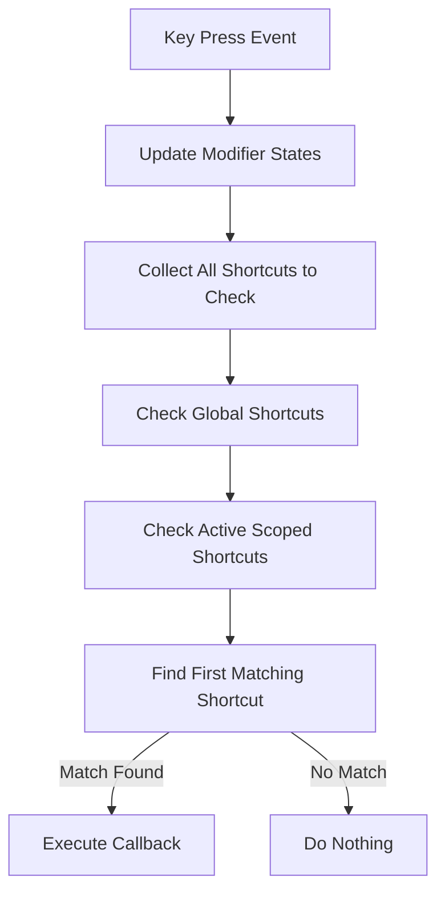

# TodayNote Shortcut System Architecture

## Overview

This app uses a keyboard shortcut system that supports both global and context-sensitive (scoped) shortcuts. 

## Core Concepts

### 1. Two Types of Shortcuts

- **Global Shortcuts**: Always active, regardless of context (e.g., `Ctrl+S` to save)
- **Scoped Shortcuts**: Only active when a specific scope is active (e.g., `Ctrl+B` for bold only works in editor)

### 2. Scope Activation

Scopes are contexts where certain shortcuts should be available:
- `editor-formatting`: When the note editor has focus
- `modal`: When a modal dialog is open
- Custom scopes can be defined as needed

## Architecture

### Input Manager (`input.svelte.ts`)

The central `InputManager` class handles all keyboard events and maintains:

```typescript
class InputManager {
    // Global shortcuts (always active)
    private shortcuts: ShortcutRegistration[] = [];
    
    // Scoped shortcuts (only active when scope is active)
    private scopedShortcuts: Map<string, ShortcutRegistration[]> = new Map();
    
    // Currently active scopes
    private activeScopes: Set<string> = new Set();
}
```

### Shortcut Registration

#### Global Shortcuts
```typescript
// Simple syntax - these are always active
useShortcuts({
    save: handleSave,
    search: handleSearch,
    newNote: handleNewNote
});
```

#### Scoped Shortcuts
```typescript
// Scoped syntax - only active when 'editor' scope is active
useShortcuts('editor', {
    toggleBold: handleBold,
    toggleItalic: handleItalic
});

// With manual activation control
useShortcuts('editor', {
    toggleBold: handleBold
}, false); // Don't auto-activate
```

## How Shortcuts Are Processed

### 1. Key Press Event Flow



### 2. Priority System

When a key is pressed:

1. **Collect all applicable shortcuts**:
   ```typescript
   const shortcutsToCheck = [...this.shortcuts]; // Global first
   
   for (const scope of this.activeScopes) {
       const scoped = this.scopedShortcuts.get(scope) || [];
       shortcutsToCheck.push(...scoped); // Then scoped
   }
   ```

2. **Check in reverse order** (scoped shortcuts have priority):
   ```typescript
   for (let i = shortcutsToCheck.length - 1; i >= 0; i--) {
       const registration = shortcutsToCheck[i];
       // Check if this shortcut matches the pressed keys
       // First match wins!
   }
   ```

### 3. Modifier Key Handling

The system automatically handles platform differences:
- **Mac**: `⌘` (Command) as primary, `⌥` (Option) as secondary
- **Windows/Linux**: `Ctrl` as primary, `⇧` (Shift) as secondary

## Scope Management

### Activating and Deactivating Scopes

```typescript
// Activate a scope (makes its shortcuts available)
inputManager.activateScope('editor');

// Deactivate a scope (hides its shortcuts)
inputManager.deactivateScope('editor');

// Check if a scope is active
const isActive = inputManager.activeScopes.has('editor');
```

### Example: Editor Focus Management

```typescript
// In NoteFormatter.svelte
$effect(() => {
    if (!editorInstance) return;

    const view = editorInstance.ctx.get(editorViewCtx);
    const dom = view.dom;

    const handleFocus = () => inputManager.activateScope('editor-formatting');
    const handleBlur = () => inputManager.deactivateScope('editor-formatting');

    dom.addEventListener('focus', handleFocus, { capture: true });
    dom.addEventListener('blur', handleBlur, { capture: true });

    return () => {
        dom.removeEventListener('focus', handleFocus, { capture: true });
        dom.removeEventListener('blur', handleBlur, { capture: true });
        inputManager.deactivateScope('editor-formatting');
    };
});
```

## Shortcut Configuration

Shortcuts are defined in the settings system and can be customized by users:

```typescript
// Example shortcut configuration
const shortcuts = {
    save: {
        primary: true,
        key: 's'
    },
    toggleBold: {
        primary: true,
        key: 'b'
    },
    // ... other shortcuts
};
```


